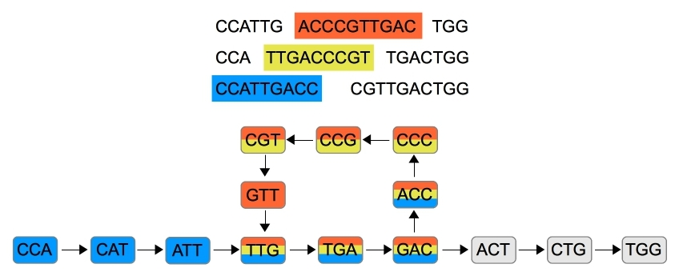
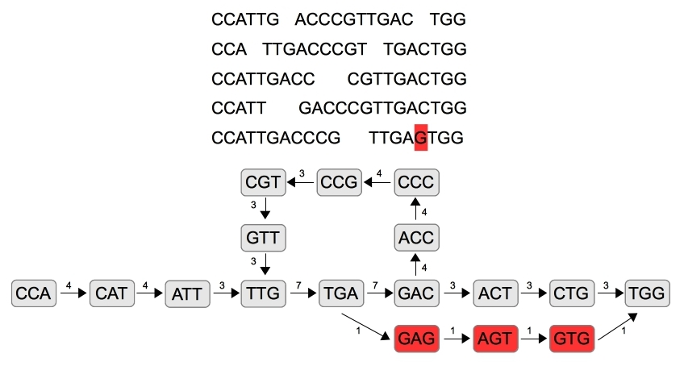
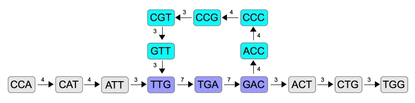

Sabe: Sequence Assembly By Euler tours
======================================

By Philip M. Hubbard, 2014

Overview
--------

Sabe is a Java library for genome sequencing.  It provides code for assembling a long DNA sequence from a set of short fragments using Euler tours of De Bruijn graphs.  The library has code for a simple sequential implementation, and a more sophisticated version that can run on many machines using [MapReduce](http://en.wikipedia.org/wiki/MapReduce) techniques in [Hadoop](https://hadoop.apache.org).  The MapReduce version incorporates techniques for handling errors in the initial fragments and repetitive sections in the final sequence.

Approach
--------

The idea for assembling sequences by performing Euler tours on De Bruijn graphs has been described by a number of authors, such as [Pevzner et al.](http://www.ncbi.nlm.nih.gov/pmc/articles/PMC55524) and [Schatz et al.](http://www.cbcb.umd.edu/~mschatz/Posters/BOG.2010%20-%20Contrail.pdf).  The input is a large set of *reads*, fragments of a long DNA sequence, typically generated by so-called next-generation sequencing (NGS) techniques.  The goal is to reconstruct the DNA sequence.  The reads are represented as strings involving the nucleotide characters "A", "C", "G" and "T".  Each such read is broken down into a series of `k`-element substrings or *`k`-mers*, with one substring overlapping the previous one at `k-1` characters.  The overlap regions or *`(k-1)`-mers* can be considered as the vertices of a *De Bruijn graph*, and the `k`-mers represent directed edges between these vertices.

Here is an example De Bruijn graph built from eight reads, with `k-1 = 3`.  Note that the overlapping regions from different reads correspond to common vertices, as indicated by the color coding.  Common vertices thus serve to correlate and combine the reads.

The problem of reconstructing the sequence becomes a problem finding a path that visits all the vertices using each edge exactly once.  Such as path is known as an [*Euler tour*](http://en.wikipedia.org/wiki/Eulerian_path), and there is a classic sequential algorithm that finds an Euler tour (if one exists) with a running time linear in the number of edges.  The `BasicAssembler` class implements a simple sequential version of this approach, using the `digraph.EulerPaths` class from the [Digraph](http://github.com/philiphubbard/Digraph) library.

Naturally occurring DNA sequences are long, and assembling such a sequence requires a large number of initial reads.  The resulting graph is large, and slow to process with a sequential algorithm even if it is linear in the number of edges.  [Schatz](http://schatzlab.cshl.edu/presentations/2010-03-15.XGen-Scalable%20Solutions.pdf) reports a characteristic important for a more efficient approach, that the graph tends to have long linear chains of edges, with relatively few branch vertices.  The more efficient approach uses a multiprocessor algorithm to compress these linear chains, creating a drastically simplified graph that can be processed more efficiently by a sequential assembly algorithm.  The `MRAssembler` class implements a version of this approach using the Hadoop implementation of the MapReduce (MR) framework for multiprocessor computation.

The multiprocessor algorithm for compressing chains works as follows.  It randomly picks adjacent pairs of vertices to compress (e.g., if it picks `A` and `B` then `A->B->C` is compressed to `A->C`).  The random picking is done so that a vertex cannot be involved in compression with both its predecessor and successor (e.g, there would not be both compression of `A->B->C` to `A->C` and `B->C->D` to `B->D`, which would eliminate the possibility of compressing the chain again to `A->D`).  The algorithm makes repeated iterations of this random compressing until it meets a termination condition.  The MapReduce version of this algorithm involves a mapper that does the random picking and a reducer that does the compressing.

The building of the original uncompressed graph can also be done by a multiprocessor algorithm.  The edges for each vertex come from multiple distinct reads.  A MapReduce algorithm can split each read into vertices and edges and gather the edges belonging to the same vertex to produce a complete description of each vertex.

In practice, some errors are inevitable in the initial reads.  A nucleotide character can be read incorrectly or omitted from a read.  One way to correct these errors involves exploiting the redundancy of the overlapping regions in the reads, also known as the *coverage*.  Coverage leads to the graph having edge multiples, more than one edge between a given pair of vertices.  The error correction scheme involves discarding vertices with edge multiples low enough to be unlikely given the coverage.  Such a scheme can be incorporated into the MapReduce algorithm for building the graph.

When edge multiples do not suggest an error, the simplest approach is to replace the multiples with a single edges.  Doing so has the desired effect of merging separate reads into a coherent whole.  But it also eliminates repetitive DNA sections, known as *repeats*.  As [Treangen and Salzberg](http://www.ncbi.nlm.nih.gov/pmc/articles/PMC3324860/) describe, repeats are an important part of naturally occurring DNA sequences. So after `MRAssembler` performs chain compression and before it finds the Euler tour, it uses a linear algorithm to analyze the edge multiples.  If edge multiples are consistent with a repeat, it retains the multiples, otherwise it replaces them with single edges.

Graph Building with Error Handling
----------------------------------

The graph is built by a MapReduce job run by `MRBuildMerVertices`, a subclass of the `MRBuildVertices` class from the [Digraph](http://github.com/philiphubbard/Digraph) library.  The role of the subclass is to override a function to parse input files and produce instances of the appropriate `digraph.MRVertex` subclass.

In the context of `MRAssembler`, the input files contain the initial reads.  The appropriate `digraph.MRVertex` subclass is the `MRMerVertex` class.  Its `digraph.MRVertex` part describes the edges of the vertex, and its additional data is an instance of the `MerString` class.  Each `MerString` instance stores a packed representation of a string of nucleotide characters, using two bits per character.  The `MerString` instance gets updated during chain compression, described in the next section.

As described earlier, the graph building stage handles errors in the reads.  The approach exploits coverage, having enough reads that each part of the final sequence is covered multiple times by multiple reads.  [Treangen and Salzberg](http://www.ncbi.nlm.nih.gov/pmc/articles/PMC3324860/) report that NGS techniques generate deep coverage, and `MRAssembler` assumes a uniform coverage that it takes as a parameter, which can be called `c`.  It uses a "majority rules" approach, so a vertex that has less than `ceiling(c/2)` edge multiples is considered an error and is discarded.  This approach to omitting erroneous parts of the graph is another capability supported by `digraph.MRBuildVertices`.

Here is an example.  As in the previous example, `k-1 = 3`, but this example has more reads, and the coverage is `c = 5`.  One read contains an error, indicated in red: it starts "TTGAG" instead of "TTGAC".  This error introduces three new vertices in the graph, also indicated in red.  Since each of these vertices has edge multiples of only `1 < ceiling(c/2)`, they are discarded as errors.  (Edge multiples are indicated with the small numbers beside the arrows between the vertices.)

Chain Compression
-----------------

Long linear chains in the graph are compressed by a MapReduce job run by `MRCompressMerChains`, a subclass of the `MRCompressChains` class from the [Digraph](http://github.com/philiphubbard/Digraph) library.  The role of the subclass is to make the `digraph.MRVertex` instances be `MRMerVertex` instances.  The `MRMerVertex` class overrides `digraph.MRVertex.compressChainsInternal()` to merge `MerStrings`.  

When a `MRMerVerex` is first created, its `MerString` instance stores the nucleotide characters of the `(k-1)`-mer corresponding to the vertex, built with the help of the `Mer` class.  Compression of a pair of adjacent vertices merges one `MerString` into the other.  Compression eliminates one edge between `(k-1)`-mers, so the `MerString` merging adds the characters of the second `MerString` after the `k-2` overlapping characters.  With this `MerString` merging, the compressed graph still maintains all the nucleotide information of the original graph in a more concise form.

Details of the MapReduce algorithm appear in the documentation for the [Digraph](http://github.com/philiphubbard/Digraph) library.  The algorithm proceeds in repeated iterations, with each iteration randomly choosing vertex pairs to compress.  The algorithm stops iterating after `t` consecutive iterations achieve no compressions (due to the randomness), where `t` is a parameter to `MRCompressMerChains`.

The most important performance characteristic is the number of iterations, since each MapReduce iteration involves overhead.  The [Digraph](http://github.com/philiphubbard/Digraph) library contains code to numerically solve for the expected value of the number of iterations, and also the expected value of the final length after termination, for a given initial chain length, `n`, and a `t` parameter for the termination condition.  Analysis of these expected values as `n` increases suggests that the best termination condition is `t = 1`, stopping after only one iteration without any compressions; waiting for multiple consecutive iterations without compressions costs too many additional iterations without sufficient benefit in the final length.  When terminating at `t = 1`, the expected final length at termination is between 3 and 4, and the expected number of iterations is well fit by the curve `2.36 * lg(n) - 2.69`.  See the documentation of the [Digraph](http://github.com/philiphubbard/Digraph) library for more details.

Repeats
-------

The `MRAssembler` code to analyze repeats runs after the code to compress chains and before the code to find the Euler tour.  Its analysis of the edge multiples in the compressed graph is based on the following idea, assuming the coverage is `c = 1`.  If there is a path of two edge multiples from one branch vertex, `B1`, to the next branch vertex, `B2`, then the path from `B1` to `B2` represents a repeat if there is also a path from `B2` back to `B1`.  The path from `B2` back to `B1` exists if `B1` and `B2` are in the same *strong component* (also known as a [*strongly connected component*](http://en.wikipedia.org/wiki/Strongly_connected_component)).  There are classic algorithms for finding strong components in linear time, like the algorithm from Tarjan implemented in the [Digraph](http://github.com/philiphubbard/Digraph) library.

The situation is more complex for deeper coverage, `c > 1`.  Consider the case of a path from `B1` to `B2` occurring exactly twice; since it can be considered to be an original occurrence plus one repetition, we call it a *single repeat*.  Edge multiples less than `ceiling(c/2)` represent errors and have been omitted already by `MRBuildMerVertices`, so there will be at least `2 * ceiling(c/2)` edge multiples on the path from `B1` to `B2`.  Since the path from `B1` to `B2` is repeating only once, there need be only one path from `B2` back to `B1`.  The edge multiples on this path can be ignored, because edge multiples too low have been eliminated as errors already.  So the check for strong components is sufficient again to check for this path back.

The `Repeats` class has a `rectifySingle()` function that implements this algorithm.  It is based on depth-first search.  When it finds a branch vertex, it walks back along the path to the previous branch vertex.  If all edge multiples along that path are at least `2 * ceiling(c/2)` and the two branch vertices are in the same strong component, then the path is a single repeat.  In that case, the edge multiples along the path are reset to two; otherwise, they are reset to one.  At the end of this process, edge multiples exist only for single repeats, and these edge multiples are exactly two, so the graph is ready to be checked for an Euler tour.  The `rectifySingle()` function is linear in the size of the graph (the number of vertices plus the number of edges) because depth-first search is linear, and the additional processing adds at most a constant number of additional visits to each edge.

Here is the graph from the previous example, for `c = 5` (with the read error removed). The vertices in the single repeat are colored violet.  The vertices in the path back to the start of the repeat are colored cyan.  (Again, the edge multiples are the small numbers beside the arrows.)

As mentioned in the final section, below, it is future work to extend to algorithm to handle repeats beyond single repeats.

Testing
-------

The main routine of the `SabeTest` class calls routines from the `MerTest`, `MerStringTest`, `BasicAssemblerTest`, `MRMerVertexTest` and `RepeatsTest` classes to test the functionality of the `Mer`, `MerString`, `BasicAssembler`, `MRMerVertex` and `Repeats` classes in a sequential setting.  These tests use `assert()` so the run configuration must be set to include "-ea" in the VM arguments.

The `MRAssemblerTest1` and `MRAssemblerTest` classes are drivers for running the Hadoop jobs of the `MRAssembler` class on two different test cases, one simple and one more complex.

Building
--------

This library was developed with the Eclipse Kepler (4.3.1) IDE on OS X (10.9.4).  Sabe uses the [Digraph](http://github.com/philiphubbard/Digraph) library, so Digraph must be added to the project build path (e.g., through the "Build Path/Configure Build Path.../Projects" menu in Eclipse).  The Hadoop-related classes require that the following external JARs from the Hadoop 2.2.0 installation be added (e.g., through the "Build Path/Configure Build Path.../Libraries/Add External JARs..." menu in Eclipse):

* share/hadoop/common/lib/commons-cli-1.2.jar
* share/hadoop/common/hadoop-common-2.2.0.jar
* share/hadoop/mapreduce/hadoop-mapreduce-client-core.2.2.0.jar

Future Work
-----------

* It should be possible to extend the algorithm in `Repeats.rectifySingle()` to handle repeats beyond single repeats.  The challenge is that the identification of the "loop-back" path can no longer rely simply on checking strong components, because it will now need to check for multiple distinct paths from `B2` back to `B1`.

* [Treangen and Salzberg](http://www.ncbi.nlm.nih.gov/pmc/articles/PMC3324860/) discuss techniques that handle repeats by using mate pairs, pairs of reads that cover the same region of the sequence in opposite directions.  It would be interesting to consider ways to combine those techniques with the algorithm(s) in the `Repeats` class.

* Other error-handling techniques, such as those surveyed by [Molnar](http://ir.lib.uwo.ca/cgi/viewcontent.cgi?article=2391&context=etd), could be incorporated into `MRAssembler`.

* The code should report partial results when malformed input (e.g., reads that produce a graph with multiple sources or sinks) prevents the assembly of one final sequence.

* The confidence tests currently do not use the [JUnit](http://junit.org) class framework for unit tests.  Perhaps they should.

* Some authors, like [Sakr](http://www.ibm.com/developerworks/opensource/library/os-giraph), argue that the MapReduce paradigm of Hadoop is not the best way to process graphs in parallel.  It might be worth investigating other frameworks, like [Giraph](http://giraph.apache.org).

